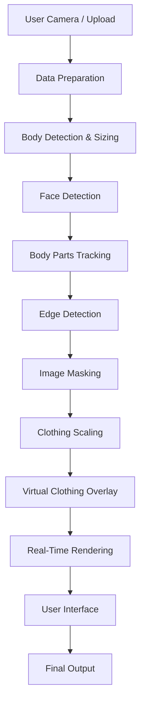

<p align="center">
  
</p>

<h1 align="center">👗 ARShop – Virtual Try-On System</h1>

<h3 align="center">
Hack X Amrita 2.0 – Igniting Ideas & Inspiring Impact
</h3>

<p align="center">
An AI-powered <b>Real-Time Augmented Reality Clothing Try-On Platform</b> that enables users to virtually try outfits using Computer Vision and Deep Learning.
</p>

---

# 🚀 Project Overview

**ARShop** is an intelligent virtual try-on system designed to enhance the online shopping experience.

It detects body posture, tracks facial alignment, scales clothing dynamically, and overlays garments in real time using advanced AI-based processing.

### 🎯 Key Highlights

- 📸 Live Camera & Image Upload Support  
- 🧠 AI-Based Body & Face Detection  
- 👕 Intelligent Clothing Scaling  
- 🔄 Real-Time Augmented Overlay  
- 🌐 Web-Based User Interface  

---

# 🏗️ System Architecture



---

# 🧠 Core Modules

## 1️⃣ Body Detection & Sizing
- Detects full body using OpenCV + TensorFlow  
- Calculates bounding box dimensions  
- Determines clothing scaling ratio  

## 2️⃣ Face Detection
- Haar Cascade / Deep Learning Model  
- Aligns clothing based on face position  

## 3️⃣ Body Parts Tracking
- Shoulder & torso keypoint mapping  
- Ensures accurate garment positioning  

## 4️⃣ Data Preparation
- Frame resizing  
- Noise filtering  
- Image normalization  

## 5️⃣ Edge Detection
- Canny Edge Detection  
- Improves contour matching  

## 6️⃣ Image Masking
- Background removal  
- Transparent cloth blending  

## 7️⃣ Clothing Scaling Engine
- Dynamic resizing  
- Proportional shoulder-based adjustment  

## 8️⃣ Virtual Clothing Overlay
- Alpha blending  
- Frame-by-frame rendering  

## 9️⃣ Real-Time Processing
- Continuous camera feed processing  
- Instant AR output generation  

## 🔟 User Interface
- Flask-based Web Application  
- Upload, Preview & Output Display  

---

# 📂 Project Structure

```
ARShop-HackXAmrita2k26/
│
├── backend/
│   ├── main.py
│   ├── models/
│   ├── processing/
│   └── utils/
│
├── frontend/
│   ├── templates/
│   │   └── index.html
│   └── static/
│       ├── css/
│       ├── js/
│       └── images/
│
├── data/
│   ├── clothes/
│   ├── sample_inputs/
│   └── outputs/
│
├── assets/
│   └── architecture.jpeg
│
├── requirements.txt
└── README.md
```

---

# ⚙️ Technology Stack

| Technology | Version |
|------------|----------|
| Python | 3.8 |
| numpy | 1.21.5 |
| pillow | 8.4.0 |
| scipy | 1.8.1 |
| opencv-python | 4.2.0.32 |
| tensorflow | 2.9.0 |
| keras | 2.9.0 |
| flask | 2.1.2 |
| werkzeug | 2.2.2 |

---

# 📦 Installation Guide

## 1️⃣ Clone Repository

```bash
git clone <your-repo-link>
cd ARShop-HackXAmrita2k26
```

## 2️⃣ Create Virtual Environment

```bash
python -m venv venv
venv\Scripts\activate
```

## 3️⃣ Install Dependencies

```bash
pip install -r requirements.txt
```

---

# ▶️ Run the Application

```bash
cd backend
python main.py
```

OR

```bash
set FLASK_APP=main.py
flask run
```

Open in browser:

```
http://127.0.0.1:5000
```

---

# 🔄 Processing Workflow

```
Camera Input
   ↓
Preprocessing
   ↓
Body Detection
   ↓
Face Alignment
   ↓
Keypoint Tracking
   ↓
Clothing Scaling
   ↓
Masking & Blending
   ↓
Real-Time AR Output
```

---

# 🌟 Future Enhancements

- 3D Cloth Simulation  
- AI-Based Size Recommendation  
- Multi-Angle Try-On  
- Mobile AR Integration  
- E-Commerce Platform Integration  

---

# 👩‍💻 Developed By

<h2 align="center">🐬 Team Baby Shark</h2>

---

# 🏆 Hackathon Submission

**Event:** Hack X Amrita 2.0  
**Institution:** Amrita Vishwa Vidyapeetham  
**Project:** ARShop – Virtual Try-On System  
**Team:** Team Baby Shark  
**Year:** February 2026  

---

# 📜 License

MIT License