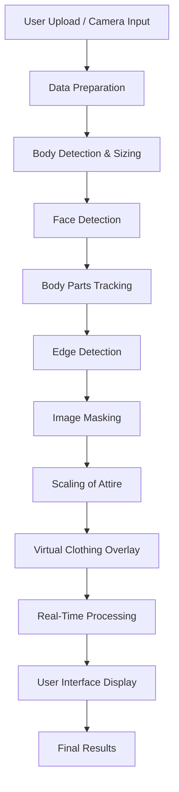

<p align="center">
  
</p>

<h1 align="center">👗 ARShop – Virtual Try-On System</h1>

<h3 align="center">
Hack X Amrita 2.0 – Igniting Ideas & Inspiring Impact
</h3>

<p align="center">
An AI-powered <b>Real-Time Augmented Reality Clothing Try-On System</b> that allows users to preview outfits virtually using Computer Vision & Deep Learning.
</p>

---

# 🚀 Project Overview

**ARShop** enables users to visualize clothing on their body in real-time using:

- 📸 Live Camera Input
- 🧠 AI-Based Body Detection
- 👕 Smart Clothing Scaling
- 🎯 Real-Time Overlay Rendering

This system bridges the gap between **e-commerce and immersive AR shopping experiences**.

---

# 🏗️ System Architecture

<p align="center">
  
</p>



---

# 🧠 Prototype Module Structure

## 🔹 1. Detecting & Sizing the Body
- OpenCV + TensorFlow
- Human body bounding box detection
- Dynamic width & height calculation

## 🔹 2. Face Detection
- Haar Cascade / Deep Learning
- Face alignment support

## 🔹 3. Image Masking
- Background removal
- Transparent PNG blending

## 🔹 4. Edge Detection
- Canny Edge Detection
- Enhances contour alignment

## 🔹 5. Scaling of Attire
- Dynamic resizing
- Shoulder-based proportional scaling

## 🔹 6. Body Parts Tracking
- Keypoint detection
- Shoulder & torso mapping

## 🔹 7. Data Preparation
- Frame resizing
- Noise reduction
- Image normalization

## 🔹 8. Virtual Clothing Overlay
- Alpha blending
- Transparent cloth positioning

## 🔹 9. User Interface
- Flask Web App
- Upload & Preview System

## 🔹 10. Real-Time Processing
- Live video frame processing
- Continuous overlay update

## 🔹 11. Results
- Final rendered output
- Downloadable preview image

---

# 📁 Project Folder Structure

```
ARShop-HackXAmrita2k26/
│
├── backend/
│   ├── main.py
│   ├── models/
│   ├── static/
│   │   ├── clothes/
│   │   ├── uploads/
│   │   └── output/
│   └── templates/
│       └── index.html
│
├── assets/
│   ├── banner.png
│   └── architecture.png
│
├── README.md
└── requirements.txt
```

---

# ⚙️ Technology Stack

| Technology | Version |
|------------|----------|
| Python | 3.8 |
| numpy | 1.21.5 |
| pillow | 8.4.0 |
| scipy | 1.8.1 |
| opencv-python | 4.2.0.32 |
| tensorflow | 2.9.0 |
| keras | 2.9.0 |
| flask | 2.1.2 |
| werkzeug | 2.2.2 |

---

# 📦 Installation Guide

## 🔹 Step 1: Clone Repository

```bash
git clone <your-repo-link>
cd ARShop-HackXAmrita2k26
```

---

## 🔹 Step 2: Create Virtual Environment

```bash
python -m venv venv
venv\Scripts\activate
```

---

## 🔹 Step 3: Install Dependencies

Create `requirements.txt`:

```txt
numpy==1.21.5
pillow==8.4.0
scipy==1.8.1
opencv-python==4.2.0.32
tensorflow==2.9.0
keras==2.9.0
flask==2.1.2
werkzeug==2.2.2
```

Install:

```bash
pip install -r requirements.txt
```

---

# ▶️ Run the Project

```bash
cd backend
python main.py
```

OR

```bash
set FLASK_APP=main.py
flask run
```

Open in browser:

```
http://127.0.0.1:5000
```

---

# 🔄 Core Processing Flow

```
Camera Input
    ↓
Data Preparation
    ↓
Body Detection
    ↓
Face Detection
    ↓
Body Tracking
    ↓
Clothing Scaling
    ↓
Image Masking
    ↓
Overlay Rendering
    ↓
Real-Time Output
```

---

# 🧪 Real-Time Frame Logic

```python
while True:
    ret, frame = cap.read()
    body = detect_body(frame)
    face = detect_face(frame)
    scaled_cloth = scale_clothing(body)
    output = overlay_cloth(frame, scaled_cloth)
    cv2.imshow("ARShop Virtual Try-On", output)
```

---

# 🖼️ How to Add Top Banner Image

1️⃣ Create folder:

```
assets/
```

2️⃣ Add your hackathon banner:

```
assets/banner.png
```

3️⃣ It will automatically show at the top.

---

# 🌟 Future Enhancements

- 3D Cloth Simulation
- AI-Based Size Recommendation
- Multi-Angle Try-On
- Mobile AR Integration
- E-Commerce API Integration

---

# 👩‍💻 Developed For

**Hack X Amrita 2.0**  
Amrita Vishwa Vidyapeetham  
February 2026  

---

# 📜 License

MIT License